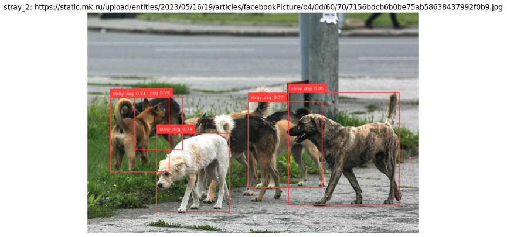
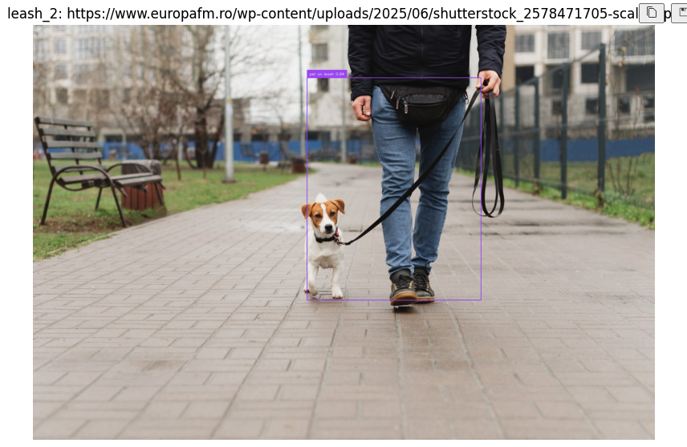
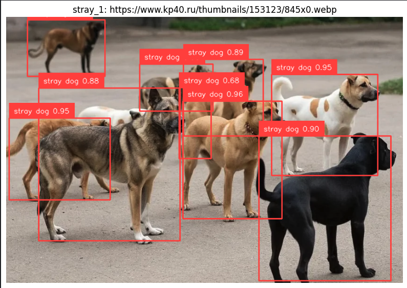

# Мониторинг бродячих собак в городе с помощью предобученной модели (Roboflow)

## Описание проекта
Проект — прототип IT-решения для **мониторинга городской экосистемы** через анализ визуальных данных.
Цель: по фотографии/кадру автоматически обнаруживать:

- **`stray dog`** — бродячих собак
- **`pet on leash`** — собак на поводке (домашние)

Решение оформлено в виде **Jupyter Notebook** и использует **предобученную модель/Workflow Roboflow**.

## Проблема (контекст и актуальность)
В ряде городов и регионов актуальна проблема бродячих собак:

- **Безопасность**: риск нападений/травм.
- **Городское планирование**: важно понимать, где и когда фиксируется наибольшая активность.
- **Нагрузка на службы**: отлов/стерилизация/приюты требуют данных, а не “ощущений”.

Традиционный мониторинг (обходы, разовые сообщения жителей) даёт **разрозненную и запаздывающую** картину.

## Решение (концепция)
Идея решения: автоматизировать первичную аналитику по фотоматериалам (или кадрам с камер) с помощью CV-модели.

В ноутбуке реализовано:

- вызов Roboflow Workflow по изображению;
- преобразование ответа в детекции (`supervision`);
- **постобработка**, чтобы уменьшить ошибки вида “вложенные боксы” и конфликт классов;
- визуализация боксов и печать итоговой сводки по каждому изображению.

## Состав проекта
- **Ноутбук с решением**: `practice_project/notebooks/solution.ipynb`
- **Тестовые изображения**: задаются в блоке “Блок 4: Тестовые изображения” внутри ноутбука (обычно URL).

## Как запустить (Jupyter Notebook)

Реализация в Google colab: https://colab.research.google.com/github/stepkar/practice_project/blob/master/notebooks/solution.ipynb

### 1) Подготовка окружения
Рекомендуется Python **3.11** и виртуальное окружение `.venv`.

```bash
cd practice_project
python3.11 -m venv .venv
source .venv/bin/activate
python -m pip install --upgrade pip
python -m pip install opencv-python numpy requests matplotlib pillow supervision inference-sdk ipykernel
```

### 2) Подключить kernel к `.venv` (чтобы ноутбук запускался тем же Python)

```bash
python -m ipykernel install --user --name practice_project --display-name "practice_project (.venv)"
```

После этого в IDE/Jupyter выберите kernel **`practice_project (.venv)`** и перезапустите его.

### 3) Запуск ноутбука
Откройте `practice_project/notebooks/solution.ipynb` и выполните ячейки **сверху вниз**.

## Что можно настраивать
В блоке конфигурации ноутбука:
- **`CONF_THRESHOLD`**: порог уверенности; выше — меньше ложных срабатываний, но можно потерять слабые детекции.
- **`IOU_THRESHOLD`**: порог NMS; выше — сильнее “склеиваются” перекрывающиеся боксы (меньше дублей).

В постобработке (`simple_filter`) можно тонко настроить правила удаления:
- слишком маленьких боксов;
- вложенных/конфликтных боксов (`pet on leash` vs `stray dog`);
- вложенных `pet on leash` внутри `pet on leash`.

## Выходные результаты
На каждом тестовом изображении ноутбук выводит:

- аннотированное изображение (рамки + подписи + confidence);
- текстовую сводку вида: сколько объектов найдено и сколько по каждому классу;
- предупреждение, если обнаружены бродячие собаки.

## Пример результата
Ниже — примеры визуализации детекций из проекта:






